# fly-muaythai

**A simulated brain wired from a real fruit fly's connectome, trained with reinforcement learning to fight Muay Thai–style.**

6,170 real neurons from the male *Drosophila* central nervous system drive a physically simulated fly body in a two-fly ring. The wiring comes from the connectome and never changes. Recurrent PPO learns everything else from the points it scores, and you can watch every neuron light up as it jabs, kicks, clinches and lunges.

<p align="center">
  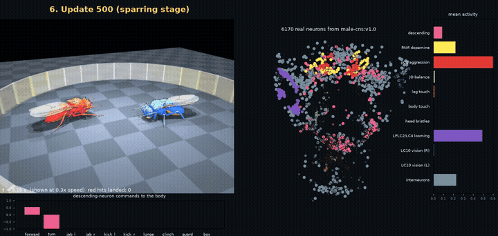
  <br><em>Update 500: red lands kicks while its real neurons (right) light up. Shown at 0.3× speed.</em>
</p>

| | |
|---|---|
| **Brain** | 6,170 neurons and 370K synaptic connections from `male-cns:v1.0` (Janelia FlyEM, via neuPrint) |
| **Learned** | 14,910 parameters: per-cell-type gains and biases, sensory gains, and a descending-neuron readout. The wiring stays fixed. |
| **Body and physics** | [flybody](https://github.com/TuragaLab/flybody) fruit fly model in [MuJoCo](https://mujoco.org); each fly weighs ~1 mg, like the real animal |
| **Learning** | Recurrent actor-critic PPO with GAE, backpropagation through time on an Apple GPU, curriculum learning, and self-play |
| **Hardware** | One 8 GB Apple Silicon MacBook: ~130 simulation steps/s, ~25 s per training update |

Real male fruit flies do fight. They lunge, box with their forelegs, grab and hold each other, and rear up in a boxing stance. This project gives that instinct a ring, a referee and a learning rule.

---

## Progression

The same opponent and the same starting positions at every point in training. Only the brain changes.

<table>
  <tr>
    <td align="center">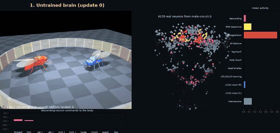<br><b>1. Untrained</b> (update 0)</td>
    <td align="center">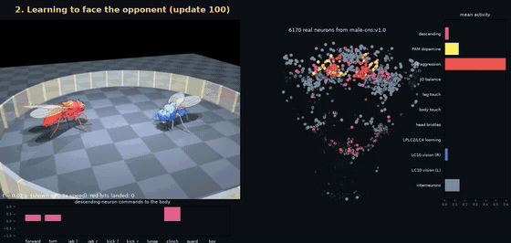<br><b>2. Learning to face the opponent</b> (update 100)</td>
  </tr>
  <tr>
    <td align="center">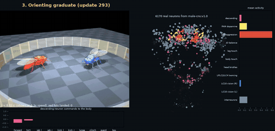<br><b>3. Orienting graduate</b> (update 293)</td>
    <td align="center">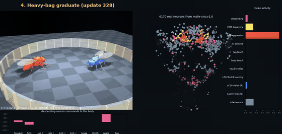<br><b>4. Heavy-bag graduate</b> (update 328)</td>
  </tr>
  <tr>
    <td align="center">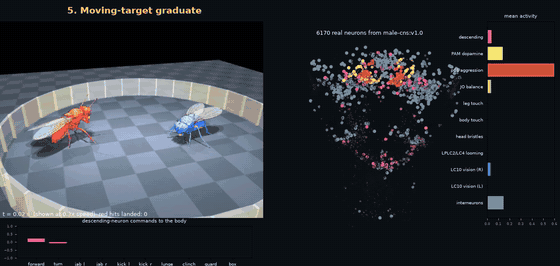<br><b>5. Moving-target graduate</b> (update 333)</td>
    <td align="center"><br><b>6. Update 500</b> (sparring stage)</td>
  </tr>
</table>

| # | Training point | Score (red : blue) | What changed |
|---|---|---|---|
| 1 | Untrained (update 0) | 0 : 1.5 | Random flailing; no tracking of the opponent |
| 2 | Update 100 | 5.2 : 3.8 | Starts turning toward the opponent; first landed strikes |
| 3 | Orienting graduate (update 293) | 19.3 : 12.5 | Keeps the opponent dead ahead and trades heavily |
| 4 | Heavy-bag graduate (update 328) | 15.8 : 11.0 | Throws 91% of strikes while facing the target |
| 5 | Moving-target graduate (update 333) | 8.2 : 3.8 | Takes far fewer hits |
| 6 | Update 500 (sparring stage) | **36.8 : 9.0** | Nose-to-nose pressure, guard up while striking, clinching |

Each row is a single bout, and the policy is stochastic, so individual bouts vary. Over an 8-bout evaluation at update 500, the fly averaged **34.8 points landed to 7.8 taken**, with **59% of strikes landing** and **92% thrown while facing the opponent**.

▶ **[Watch the full progression (79 s)](docs/media/progression.mp4)**

---

## The move set

Each move on its own, in slow motion. The legs doing the move are **yellow**. Left view: from behind the red fly (its left is your left). Right view: from above.

<table>
  <tr>
    <td align="center">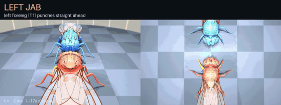<br><b>Left jab</b>: left front leg</td>
    <td align="center">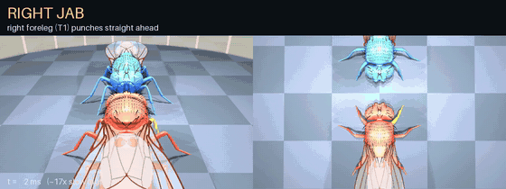<br><b>Right jab</b>: right front leg</td>
  </tr>
  <tr>
    <td align="center">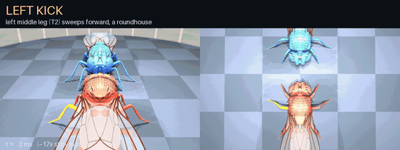<br><b>Left kick</b>: left middle leg, roundhouse</td>
    <td align="center">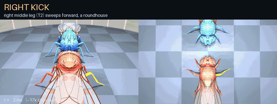<br><b>Right kick</b>: right middle leg, roundhouse</td>
  </tr>
  <tr>
    <td align="center">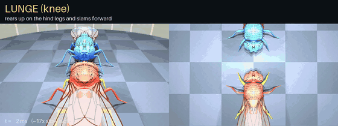<br><b>Lunge (knee)</b>: rear up and slam forward</td>
    <td align="center">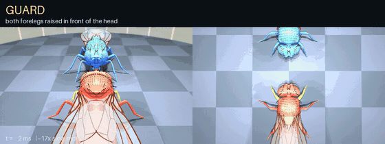<br><b>Guard</b>: forelegs up in front of the face</td>
  </tr>
  <tr>
    <td align="center">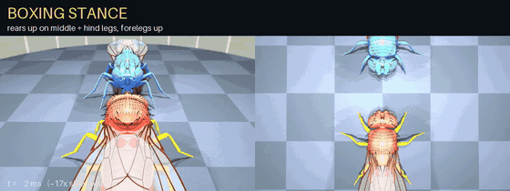<br><b>Boxing stance</b>: rear up, forelegs up</td>
    <td align="center">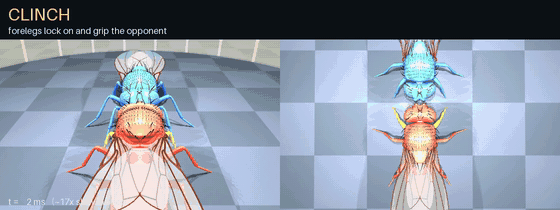<br><b>Clinch</b>: forelegs lock on and grip</td>
  </tr>
  <tr>
    <td align="center">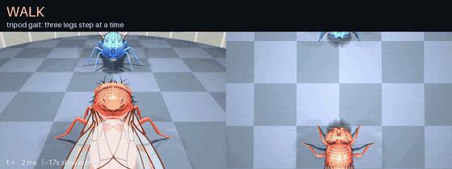<br><b>Walk</b>: tripod gait</td>
    <td align="center">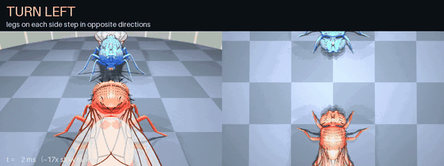<br><b>Turn</b>: sides step in opposite directions</td>
  </tr>
</table>

| Muay Thai | Fly version | Legs | Points |
|---|---|---|---|
| Jab | Front leg punches straight ahead (~90 ms) | Front (T1) | 1 |
| Roundhouse kick | Middle leg chambers out to the side, then sweeps forward and across the front (~150 ms) | Middle (T2) | 1.5 |
| Knee | Lunge: rears up on the hind legs and slams forward | Front + hind | 2 |
| Guard | Both forelegs raised in front of the face | Front | – |
| Boxing stance | Rears up ~38° on middle and hind legs, forelegs up, the stance real male flies fight in | All | – |
| Clinch | Forelegs lock on; a grip of about body weight holds the opponent head to head | Front | – |
| Knockdown | Opponent on its side or back for 0.15 s | – | 5 |

Strikes to the head score ×1.5. Strikes from the clinch score ×1.25, and knees from the clinch ×1.5. A strike only scores if the fly is facing its target within 45°.

▶ **[Full-quality video of every move](docs/media/moves.mp4)**

---

## Fight it yourself

You play the blue fly. The red fly is the trained brain, and the panel on the right shows its neurons firing as it fights you.

<p align="center">
  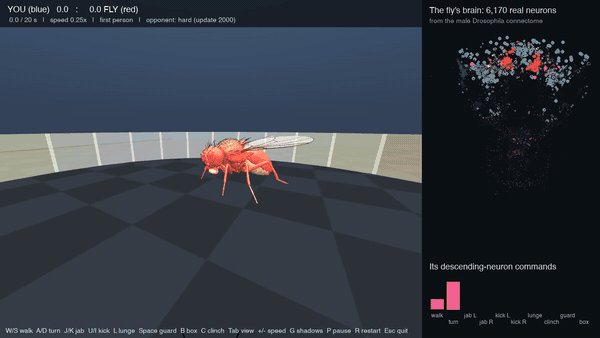
  <br><em>Play mode, recorded with a scripted player: first person, then over the shoulder (Tab).</em>
</p>

### Download and play

The trained fighters ship with the repo in `models/` (about 1.4 MB), so there's no training and no neuPrint account needed to play.

**Requirements:** Python 3.11 or 3.12 and about 2 GB of disk for dependencies (PyTorch, MuJoCo). Tested on macOS (Apple Silicon); Linux should work; Windows is untested.

**Option 1: clone with git** (recommended)

```bash
git clone https://github.com/klasinlapaprechar/fly-muaythai.git
cd fly-muaythai
python3.12 -m venv .venv && source .venv/bin/activate
pip install -e .
python -m flymt.play
```

**Option 2: download a ZIP.** On the repo page, click **Code → Download ZIP**, unzip it, open a terminal in the folder, and run the same last three commands.

If you use [uv](https://docs.astral.sh/uv/), the setup is faster: `uv venv --python 3.12 .venv && source .venv/bin/activate && uv pip install -e .`

```bash
python -m flymt.play                  # hard: the final trained brain (update 2,000)
python -m flymt.play --level medium   # update 500 (easy: update 100)
python -m flymt.play --speed 0.2      # slower "fly time"
python -m flymt.play --view third     # start over the shoulder
```

| Keys | Action |
|---|---|
| W / S · A / D | Walk forward / back · turn left / right |
| J / K | Left / right jab |
| U / I | Left / right kick |
| L | Lunge (knee) |
| Space · B · C (hold) | Guard · boxing stance · clinch |
| Tab | First person ↔ over the shoulder |
| + / − | Faster / slower |
| G · P · R · Esc | Shadows (slower) · pause · new round · quit |

The game runs in **"fly time"** (0.25× real speed by default), because a fly's jab takes ~90 ms, faster than human reaction. It renders at ~28 fps on an 8 GB MacBook.

---

## How it works

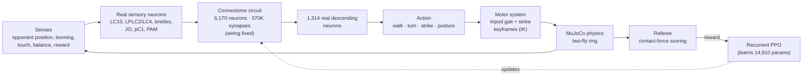

Every 10 ms, the fly's senses drive real sensory neurons. Activity spreads through the connectome-wired circuit as a firing-rate model (τ = 20 ms). The fly's 1,314 real descending neurons, its command lines from brain to body, are read out as an action:
- a walk and turn command;
- one strike choice: none, jab left/right, kick left/right, or lunge;
- one posture choice: none, guard, boxing stance, or clinch.

A scripted motor system stands in for the nerve cord. It turns those commands into leg movements using a tripod gait and inverse-kinematics strike keyframes.

### The brain

<p align="center">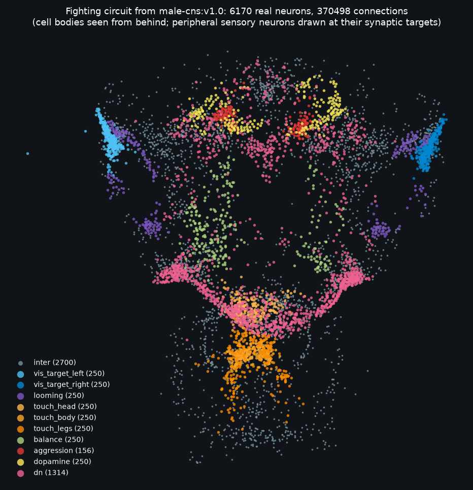</p>

The circuit is built by `flymt/connectome.py` from the male CNS connectome:

| Role | Neurons | Real cell types |
|---|---|---|
| Opponent tracking (each eye) | 250 + 250 | LC10, the visual neurons male flies use to chase rivals |
| Looming (incoming strikes) | 250 | LPLC2, LC4 |
| Touch: head, body, legs | 250 each | Head bristles (BM), body and leg tactile neurons |
| Balance | 250 | Johnston's organ (JO-C/E) |
| Aggression drive | 156 | pC1, the male-specific P1-class cluster |
| Reward (visual only) | 250 | PAM dopamine neurons; they flash when the fly scores |
| Commands to the body | 1,314 | All descending neurons |
| Interneurons | 2,700 | Selected by synapse count along real paths from sensors to descending neurons |

**What is real and what is modeled:**

| | Source |
|---|---|
| Neurons, cell types, connections, synapse counts | **Real:** `male-cns:v1.0` |
| Excitatory vs inhibitory | **Real:** predicted neurotransmitter (ACh +; GABA, glutamate, histamine −; monoamines treated as modulatory) |
| Cell-type excitability, sensory gains, command readout | **Learned** by PPO (14,910 parameters) |
| Neuron dynamics | Simplified firing-rate model |
| Eyes, bristles, antennae | Abstracted into drives for the real sensory neurons |
| Leg control below the descending neurons | Scripted motor system |

It is a model constrained by real wiring, not a full simulation of a fly brain.

### Training

Standard RL, with no scripted decisions in the brain. Twelve bouts run in parallel on CPU worker processes. Recurrent PPO backpropagates through 32-tick windows of brain activity on the Apple GPU (MPS).

**Curriculum:**

| Stage | Opponent | Graduates when | Graduated at |
|---|---|---|---|
| 0. Orient | Wanders, never strikes; the fly starts facing a random direction | Mean facing ≥ 0.8, and it passes a steering test (turns the correct way at ±15°, ±45°, ±90°, and holds steady dead ahead) | Update 293 |
| 1. Heavy bag | Stands still | Net +3 points per bout | Update 328 |
| 2. Mover | Wanders | Net +3 points per bout | Update 333 |
| 3. Sparring | Circles, steps in to strike, retreats, guards | Net +8 points per bout, ≥ 55% of strikes landing, ≤ 10% thrown out of range | Update 742 |
| 4. Mixed | Half the bouts: a scripted "veteran" that counter-punches, throws combinations and clinches. Half: past versions of its own brain (self-play). | – | Trained to update 2,000 |

**Final result (update 2,000):** over the last 48 mixed-stage bouts against the veteran and its own past selves, the fly netted **+9.1 points per bout**, with **65% of strikes landing**, **5% thrown out of range**, and facing its opponent **+0.95** (1.0 = dead ahead). In its final video bout it beat the veteran **60.9 to 46.3**, after losing to it at updates 1,000 and 1,500. It trained for about 6.1 million decisions, roughly 17 hours of simulated fighting.

**Reward design, in short:**
- **Scoring:** points for clean strikes, knockdowns and combinations.
- **Costs:** every strike thrown, every miss, any strike thrown out of range or while not facing the opponent, and missed lunges (extra).
- **Defense:** credit for slipping and blocking the opponent's strikes.
- **Clinch:** credit for entering and controlling a clinch.
- **Resets:** credit for backing out of a bad position and squaring up again.
- **Penalties:** running away without fighting back, standing around without striking, and being sideways to the opponent.

### Lessons learned

Most of the work was making the reward mean what we meant. Each of these showed up in training and was fixed:

| Problem | Cause | Fix |
|---|---|---|
| Fought side-on and turned away | Hits scored from any angle, and the old kick could only connect from the side | Strikes only count when facing within 45°; the kick was redesigned so it can reach a squared-up opponent |
| Stood still in the boxing stance and never struck (policy collapse) | Small per-tick rewards for being in range and facing outweighed the passivity penalty | Positional rewards only count while actively striking; passivity is penalized at any distance |
| Spammed strikes | Each strike was an independent coin flip every 10 ms | Strikes became one choice per tick with "none" as the default; penalties for misses and out-of-range strikes |
| Always circled one way | At full recurrence the circuit saturated and a right-side steering neuron was pinned on | Start at half recurrence; calibrate the turn output; add an orienting stage |
| Overshooting "bang-bang" steering | Reward based on cos(angle) is flat near dead ahead | Precision bonus for keeping the opponent within ~15° |
| Clinch did nothing | The clinch pose raised the forelegs but held nothing | A physical grip (capped spring ≈ body weight) plus clinch rewards |
| PPO update was biased | Walk/turn actions were clipped before being stored | Store the raw sample; the motor system bounds it |

---

## Train it yourself

Training from scratch needs a free [neuPrint](https://neuprint.janelia.org) token saved in `.env` as `NEUPRINT_APPLICATION_CREDENTIALS=...`. Training takes about 15 hours on an 8 GB MacBook.

```bash
pip install -e ".[dev]"
python -m flymt.connectome                       # build the circuit from the connectome
python -m flymt.ppo                              # train from scratch (checkpoints/)
python -m flymt.ppo --resume                     # continue from checkpoints/latest.pt
python -m flymt.visualize --ckpt checkpoints/latest.pt --stage -1 --sample   # watch a bout
python -m flymt.export_models                    # package your fighters into models/
python -m flymt.moves_demo                       # render every move in slow motion
pytest -q                                        # smoke tests
```

| Module | Role |
|---|---|
| `flymt/connectome.py` | Builds the fighting circuit from neuPrint |
| `flymt/brain.py` | PyTorch model of the circuit; it is the PPO policy |
| `flymt/ppo.py` | Recurrent PPO, parallel fight workers, curriculum, steering test |
| `flymt/fight_env.py` | Bout physics, referee, observations, rewards, clinch grip |
| `flymt/opponents.py` | Scripted opponents: mover, sparring partner, veteran |
| `flymt/motor.py` | Tripod gait, strikes and postures from IK keyframes |
| `flymt/arena.py`, `flymt/ik.py` | Two-fly ring and per-leg inverse kinematics |
| `flymt/visualize.py`, `flymt/moves_demo.py` | Bout videos with live brain activity, and the move library |
| `flymt/play.py` | Play mode: first-person fight against the trained brain |
| `flymt/export_models.py` | Packages trained fighters into `models/` |

## Credits

- Connectome: Janelia FlyEM male CNS dataset (`male-cns:v1.0`), via [neuPrint](https://neuprint.janelia.org)
- Fly body: [flybody](https://github.com/TuragaLab/flybody) (Vaxenburg et al.)
- Physics: [MuJoCo](https://mujoco.org)
